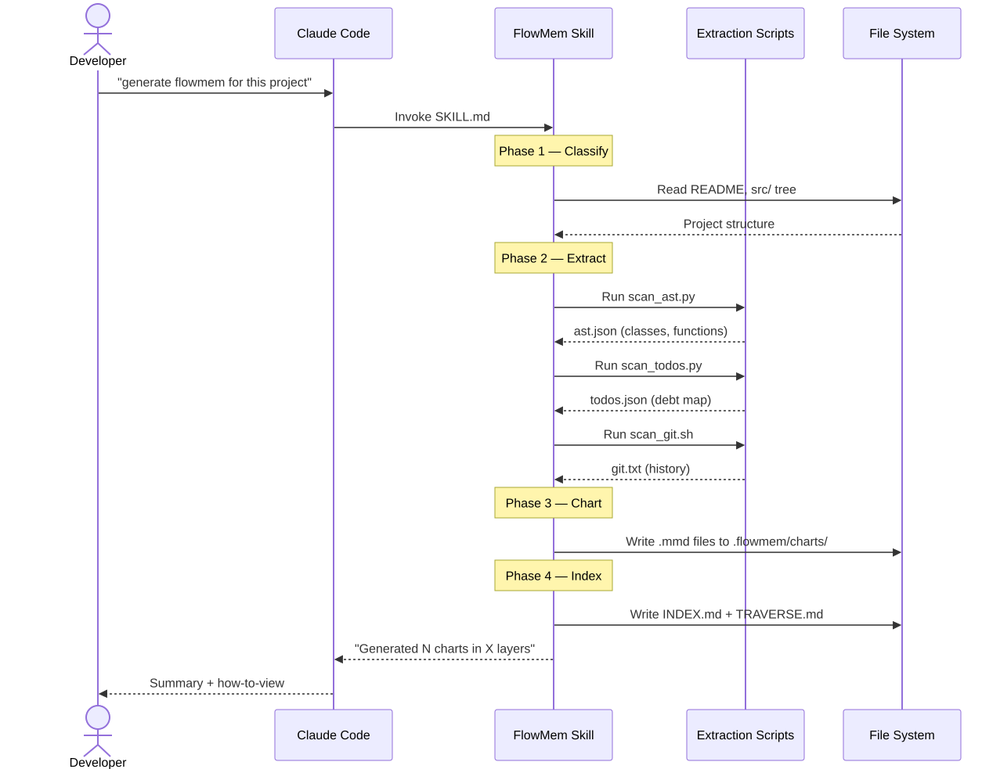
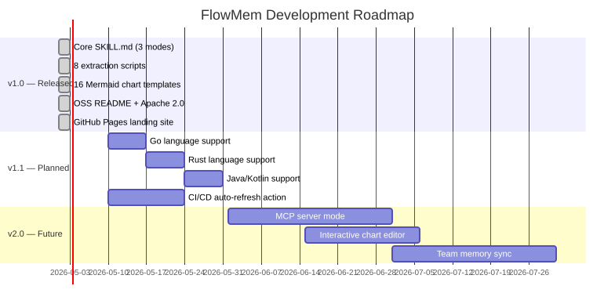
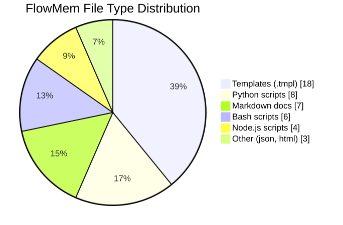
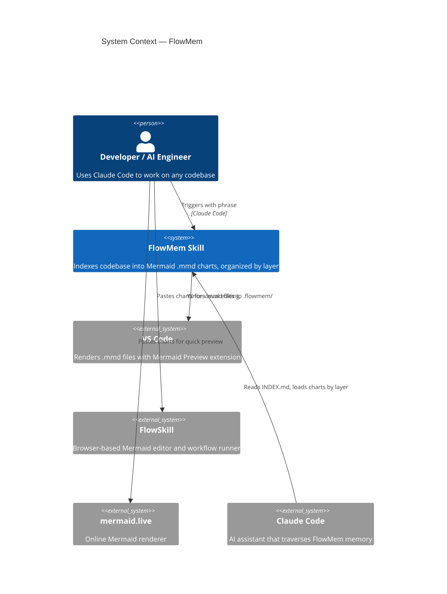
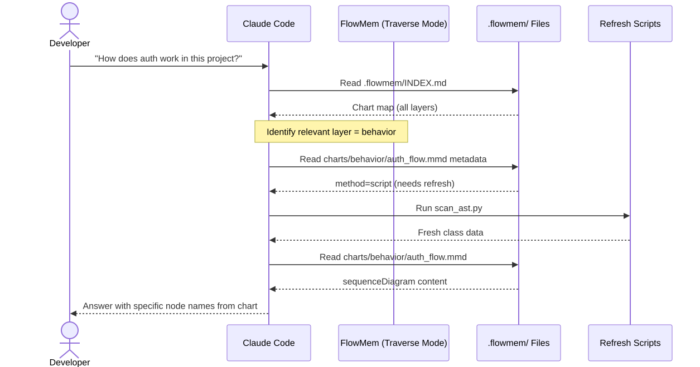

<div align="center">


# FlowMem

**AI Memory in Plain Mermaid.**

Turn any codebase into a rich, navigable chart system — human-readable in VS Code,
browsable via the auto-generated HTML viewer, AI-traversable without custom tooling.

[](LICENSE)
[](https://mermaid.js.org)
[](https://claude.ai/code)
[](https://producthunt.com)

[Install](#installation) · [How it works](#how-it-works) · [Chart gallery](#chart-gallery) · [Docs](references/) · [Live demo](#live-demo)

</div>

---

## What is FlowMem?

FlowMem is a **Claude Code skill** that indexes any codebase into a structured set of
[Mermaid](https://mermaid.js.org) `.mmd` files — organized by layer, tagged with metadata,
and traversable by any AI coding assistant.

Every feature, architecture decision, API flow, and data model becomes a chart stored in
`.flowmem/` at your project root:

```
.flowmem/
├── INDEX.md              ← AI loads this first
├── TRAVERSE.md           ← Task-based navigation guide
├── index.html            ← Browser viewer (open this to browse visually)
└── charts/
    ├── structure/        ← Code organization
    ├── behavior/         ← API flows, state machines
    ├── data/             ← Schemas, ER diagrams
    ├── project/          ← Roadmap, timeline
    └── quality/          ← Tech debt, git history
```

---

## Why FlowMem?

| | MemPalace | GitNexus | Graphify | **FlowMem** |
|---|---|---|---|---|
| Format | Proprietary | Proprietary | Proprietary graph DB | **Plain `.mmd` files** |
| Human-readable | ❌ | Partial | ❌ | ✅ VS Code + mermaid.live |
| Editable by hand | ❌ | ❌ | ❌ | ✅ Any text editor |
| Works offline | ❌ | ❌ | ❌ | ✅ No server needed |
| AI-traversable | Via API | Via API | Via API | ✅ Direct file reads |
| Integrates with IDE | Plugin needed | Plugin needed | Plugin needed | ✅ VS Code extension |
| Chart types | — | — | — | ✅ All 26 Mermaid types |
| Open source | ❌ | ❌ | ❌ | ✅ Apache 2.0 |

---

## How it works

FlowMem uses a **hybrid extraction model**:

### Script-backed charts (always fresh)
Deterministic scripts extract live data — import graphs, class hierarchies, TODO clusters,
git history. These can be refreshed any time without AI.

```bash
python3 .flowmem/scripts/scan_ast.py      # → classDiagram
python3 .flowmem/scripts/scan_imports.py  # → flowchart (module graph)
python3 .flowmem/scripts/scan_todos.py    # → mindmap (tech debt)
bash    .flowmem/scripts/scan_git.sh      # → gitGraph + timeline
```

### AI-backed charts (semantic truth)
AI reasoning generates architectural understanding — system context, API sequences, state
machines, data flows. Generated once, updated only when architecture changes.

```
C4Context diagram    ← "What is this system?"
sequenceDiagram      ← "How does auth work?"
stateDiagram-v2      ← "What's the session lifecycle?"
erDiagram            ← "What does the schema look like?"
```

### Three-step workflow

```
1. SCAN     → Run scripts + AI reasoning to extract knowledge
2. CHART    → Generate .mmd files organized by layer
3. TRAVERSE → AI loads only relevant charts to answer questions
```

---

## Chart Gallery

FlowMem generates up to **16 chart types** automatically, covering all major knowledge domains:

### Module Dependency Graph (flowchart LR)


### Tech Debt Mindmap (mindmap)


### API Sequence (sequenceDiagram)


### Task Board (kanban)


### Tech Debt Map (mindmap)


### Gantt Roadmap (gantt)


### Gantt Roadmap (gantt)


### File Distribution (pie)


### System Architecture (C4Context)


### AI Traversal Sequence (sequenceDiagram)


*Full gallery: see [references/chart-selector.md](references/chart-selector.md)*

---

## Installation

FlowMem is a Claude Code skill. Install it by copying the skill folder into your project's
(or global) `.claude/skills/` directory.

### Option A — Per-project install

```bash
# From your project root
mkdir -p .claude/skills
cp -r /path/to/flowmem .claude/skills/flowmem
```

### Option B — Global install (available in all projects)

```bash
cp -r /path/to/flowmem ~/.claude/skills/flowmem
```

### Option C — Clone and symlink

```bash
git clone https://github.com/YOUR_USERNAME/flowmem.git
ln -s "$(pwd)/flowmem" ~/.claude/skills/flowmem
```

---

## Quick Start

Once installed, open Claude Code in any project and type:

```
generate flowmem for this project
```

FlowMem will:
1. Scan your codebase (scripts + AI reasoning)
2. Generate `.mmd` charts organized by layer
3. Create `.flowmem/INDEX.md` and `TRAVERSE.md`
4. Report what was generated and how to view it

### Viewing charts

**HTML viewer** (zero install — open in any browser):
```bash
open .flowmem/index.html        # macOS
start .flowmem/index.html       # Windows
xdg-open .flowmem/index.html    # Linux
```
All charts rendered inline with mermaid.js CDN. Search, browse by layer, view method/type badges.

**VS Code**:
1. Install [Mermaid Preview](https://marketplace.visualstudio.com/items?itemName=bierner.markdown-mermaid) extension
2. Open any `.mmd` file in `.flowmem/charts/`
3. Press `Ctrl+Shift+P` → "Mermaid Preview: Open Preview"

**Online**: Paste chart content at https://mermaid.live

---

## Using FlowMem memory

After generating, future Claude Code sessions automatically use it:

```
# Examples — Claude loads only the relevant charts:
"how does the auth flow work?"        → behavior/auth_sequence.mmd
"what classes are in the store?"      → structure/classes.mmd
"where is the tech debt?"             → quality/debt.mmd
"what's planned for next sprint?"     → project/tasks.mmd
"what's the database schema?"         → data/schema.mmd
```

Add this to your `CLAUDE.md` to activate automatic traversal:

```markdown
## Memory
This project uses FlowMem. On session start:
1. Read `.flowmem/INDEX.md`
2. Load charts per `.flowmem/TRAVERSE.md` based on each question
3. Run `bash .flowmem/scripts/refresh_all.sh` if charts seem stale
```

---

## Refreshing charts

Script-backed charts can be refreshed without AI:

```bash
# Full refresh
bash .flowmem/scripts/refresh_all.sh

# Individual scripts
python3 .flowmem/scripts/scan_todos.py   # → quality/debt.mmd
bash .flowmem/scripts/scan_git.sh        # → quality/history.mmd
python3 .flowmem/scripts/scan_ast.py     # → structure/classes.mmd
```

To regenerate AI-backed charts (after architecture changes):
```
regenerate flowmem charts
```

---

## Supported languages

| Language | Class/function extraction | Import graph | Package deps |
|---|---|---|---|
| Python | ✅ `scan_ast.py` | ✅ `scan_imports.py` | via `pyproject.toml` |
| TypeScript/JavaScript | ✅ `scan_ts_exports.js` | ✅ `scan_packages.js` | ✅ `scan_packages.js` |
| Any language | Git history, TODOs, file tree | — | — |

*Extend support: add a new script in `scripts/` and reference it in SKILL.md.*

---

## Related Projects

FlowMem is part of a growing suite of open-source AI tooling:

### [FlowSkill](https://github.com/YOUR_USERNAME/FlowSkill)
A Mermaid-powered visual canvas editor — the best way to view, edit, and share FlowMem charts visually.
Built for low-code users and developers who want to work with Mermaid diagrams without writing text.

- Paste any `.mmd` file from `.flowmem/charts/` into FlowSkill's editor
- Click nodes, change shapes, export SVG/PNG
- Built with React + Zustand + mermaid.js

---

## Project structure

```
flowmem/
├── SKILL.md                    # Claude Code skill entry point
├── references/
│   ├── chart-selector.md       # Decision matrix: what content → which chart
│   ├── mermaid-cheatsheet.md   # Syntax for all 26 Mermaid types
│   ├── traversal-protocol.md   # AI traversal protocol
│   └── output-format.md        # .flowmem/ directory spec
├── scripts/
│   ├── python/                 # AST, imports, TODOs, metrics
│   ├── node/                   # npm packages, TS exports
│   └── bash/                   # git history, file tree, full refresh
├── templates/
│   ├── INDEX.md.tmpl           # Master index template
│   ├── TRAVERSE.md.tmpl        # Traversal guide template
│   └── charts/                 # 16 .mmd starter templates
├── evals/                      # Test cases and fixture repos
└── docs/                       # GitHub Pages landing site
```

---

## Contributing

1. **Add a new chart type** — add a template in `templates/charts/`, update `chart-selector.md`, reference it in `SKILL.md`
2. **Add a new language** — add a script in `scripts/` for extraction, test it on a fixture repo in `evals/fixtures/`
3. **Improve AI prompts** — the SKILL.md sections are the prompts; edit them directly
4. **Add eval cases** — add entries to `evals/evals.json`

All contributions welcome. Please open an issue first for major changes.

---

## License

Apache 2.0 — commercial use allowed, attribution required. See [LICENSE](LICENSE).

---

<div align="center">
Made with ❤️ by the FlowSkill team · Powered by <a href="https://mermaid.js.org">Mermaid.js</a> and <a href="https://claude.ai/code">Claude Code</a>
</div>
