# FlowMem Chart Selector — Decision Matrix

Use this guide to decide which Mermaid chart type to generate for each type of content.

---

## Primary Decision Matrix

| Content You Have | Chart Type | Syntax Keyword | Method | Script |
|---|---|---|---|---|
| Module/file import graph | Flowchart (LR) | `flowchart LR` | script | `scan_imports.py` |
| Class/interface/type hierarchy | Class Diagram | `classDiagram` | script | `scan_ast.py` / `scan_ts_exports.js` |
| API call sequences, request/response | Sequence Diagram | `sequenceDiagram` | ai | — |
| State machine, lifecycle, FSM | State Diagram | `stateDiagram-v2` | ai | — |
| Database schema, ORM models | ER Diagram | `erDiagram` | ai | read schema files |
| Feature roadmap, sprint plan | Gantt | `gantt` | ai | — |
| System layers (C4 style) | C4 Architecture | `C4Context` | ai | — |
| Task board, feature status | Kanban | `kanban` | ai | — |
| Tech debt topics, TODO clusters | Mind Map | `mindmap` | script+ai | `scan_todos.py` |
| Git commit history, branches | Git Graph | `gitGraph` | script | `scan_git.sh` |
| Complexity vs. value analysis | Quadrant Chart | `quadrantChart` | script | `scan_metrics.py` |
| Data/resource/energy flows | Sankey | `sankey` | ai | — |
| Project/changelog timeline | Timeline | `timeline` | ai | `scan_git.sh` optional |
| Test coverage heatmap | Radar | `radar` | ai | read coverage report |
| Bug/issue type distribution | Pie Chart | `pie` | script | grep issue labels |
| System requirements traceability | Requirement Diagram | `requirementDiagram` | ai | — |
| User journey / UX flow | User Journey | `journey` | ai | — |
| Network infrastructure | Architecture (beta) | `architecture-beta` | ai | — |
| Cause-and-effect / RCA | Ishikawa/Fishbone | `---` (not yet stable) | ai | — |
| File size breakdown | Pie Chart | `pie` | script | `scan_files.sh` |
| npm dependency tree | Flowchart (TB) | `flowchart TB` | script | `scan_packages.js` |
| XY metrics scatter | XY Chart (beta) | `xychart-beta` | script | `scan_metrics.py` |

---

## Layer Assignment

Once you select a chart type, assign it to a layer:

| Layer | Contains | Load when... |
|---|---|---|
| `structure` | flowchart (imports), classDiagram, architecture | understanding code organization |
| `behavior` | sequenceDiagram, stateDiagram | tracing execution flows |
| `data` | erDiagram, sankey | understanding data models or flows |
| `project` | gantt, kanban, timeline, requirementDiagram | planning or feature context |
| `quality` | mindmap (debt), pie (distribution), radar, quadrantChart, gitGraph | health and history |

---

## Chart Type Examples

### flowchart LR — Module Dependencies

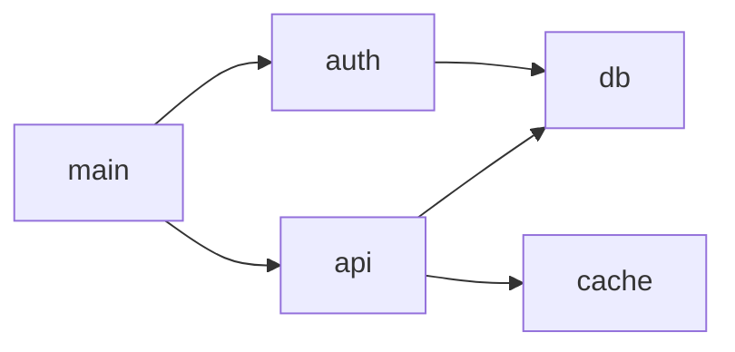

### classDiagram — Class Hierarchy

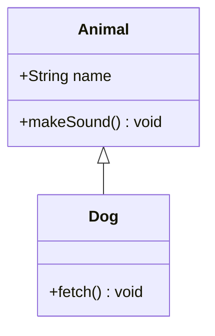

### sequenceDiagram — API Flow

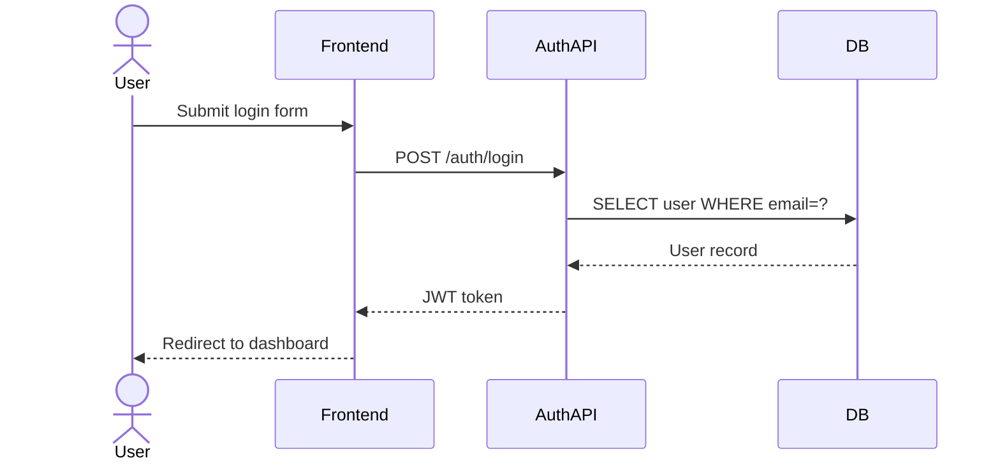

### stateDiagram-v2 — Lifecycle

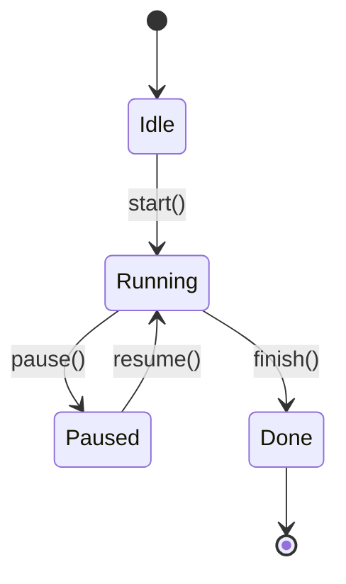

### erDiagram — Database Schema

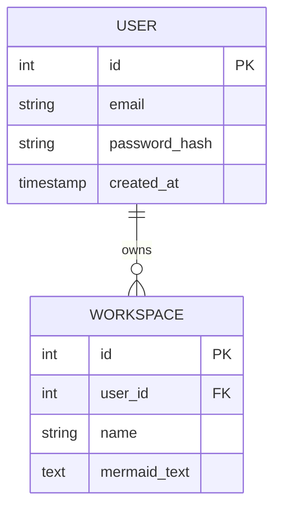

### gantt — Roadmap

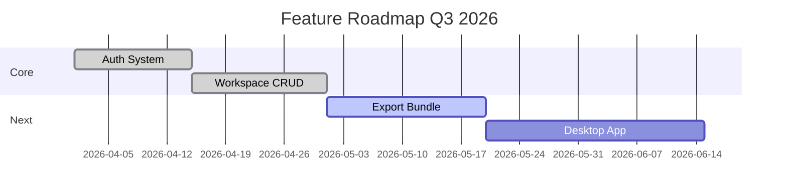

### mindmap — Tech Debt

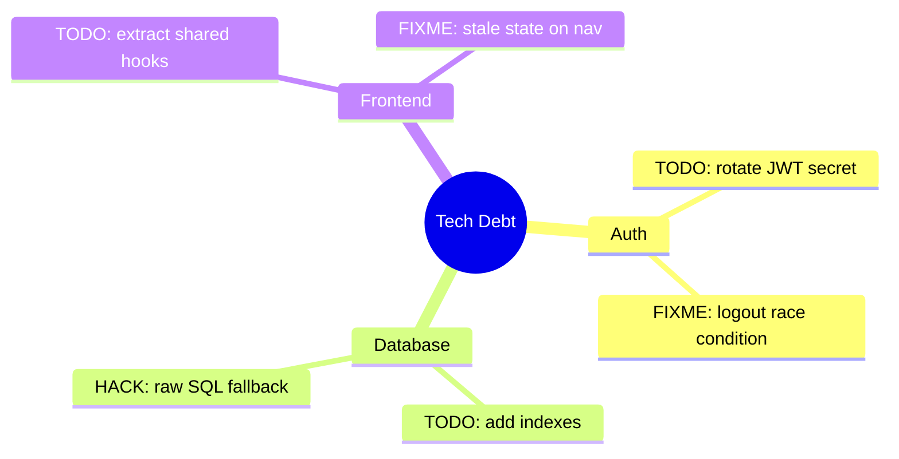

### gitGraph — Branch History

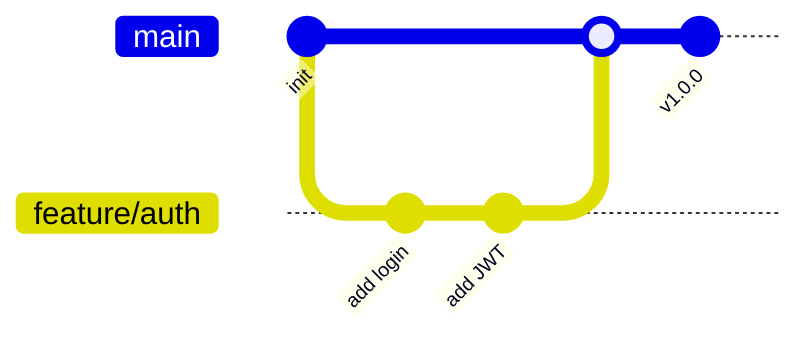

### pie — File Distribution

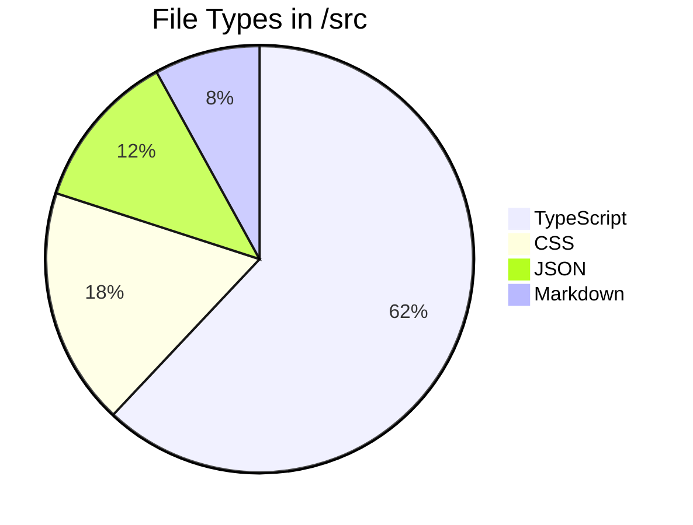

### radar — Coverage

```mermaid
radar
    title Test Coverage by Module
    Auth : 92
    API : 78
    Database : 85
    Frontend : 44
    Engine : 70
```

### kanban — Feature Board

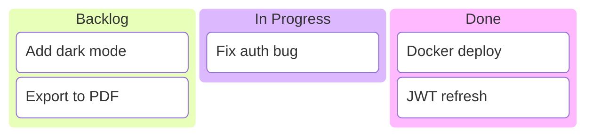

### C4Context — System Architecture

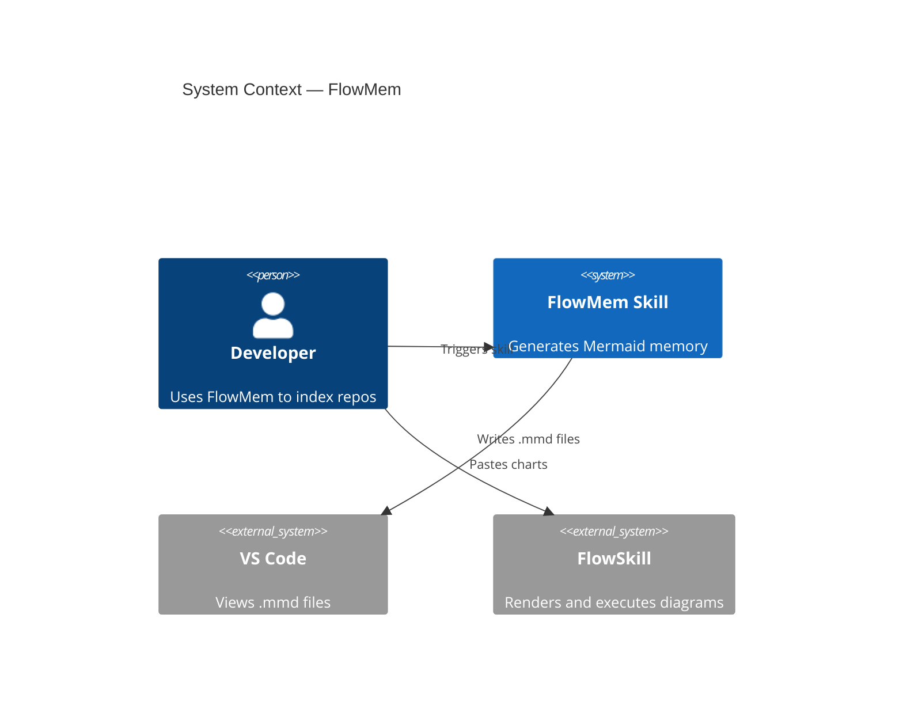

### timeline — Project History

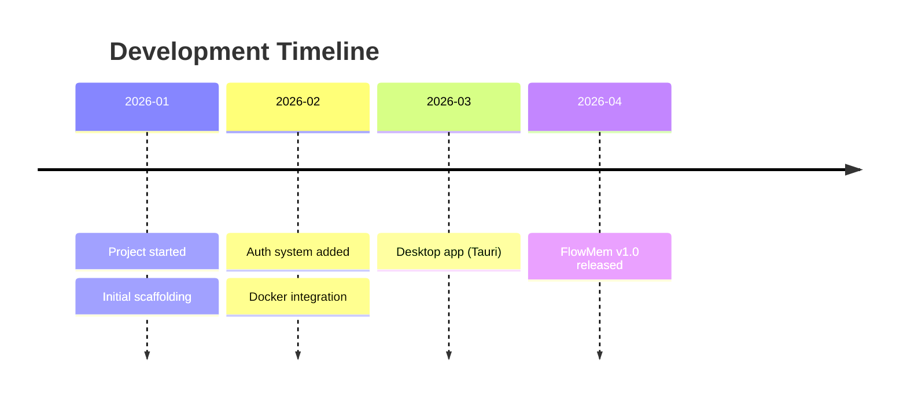

### quadrantChart — Complexity vs Value

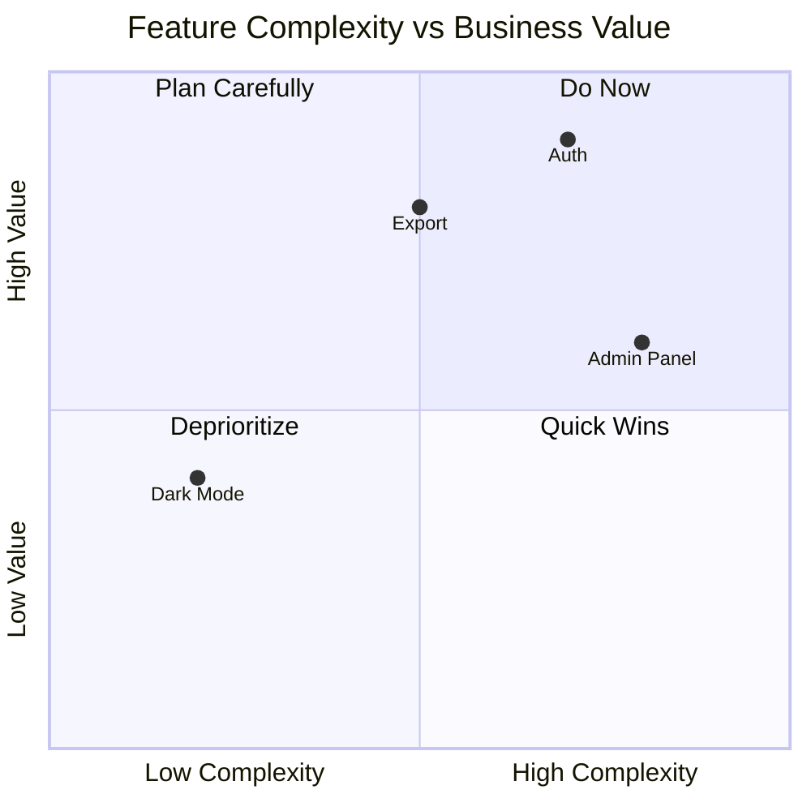

### requirementDiagram — Formal Requirements

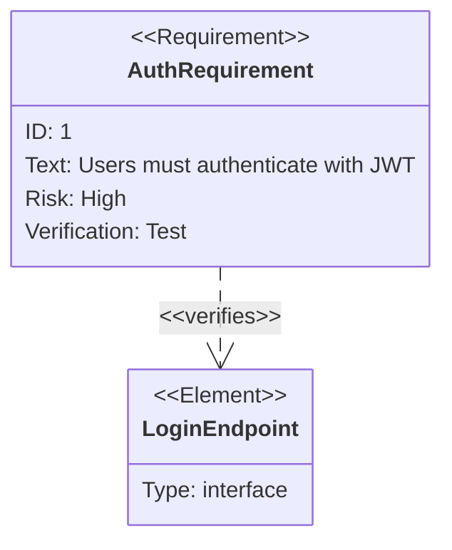

---

## Choosing Between Similar Types

**flowchart vs. sequenceDiagram:**
- Use `flowchart` for static structure (module relationships, code paths)
- Use `sequenceDiagram` for dynamic runtime interactions (who calls whom and when)

**classDiagram vs. erDiagram:**
- Use `classDiagram` for code-level class/interface/type relationships
- Use `erDiagram` for database-level entity and column relationships

**gantt vs. kanban vs. timeline:**
- Use `gantt` for time-boxed planning with start/end dates
- Use `kanban` for current-state task board (what's in progress now)
- Use `timeline` for historical milestones (what already happened)

**mindmap vs. pie:**
- Use `mindmap` when debt/issues have category hierarchy
- Use `pie` for flat distribution/proportion data
