# Mermaid Cheatsheet — All 26 Diagram Types

Quick syntax reference for every Mermaid diagram type supported as of Mermaid 11.x.

---

## 1. Flowchart

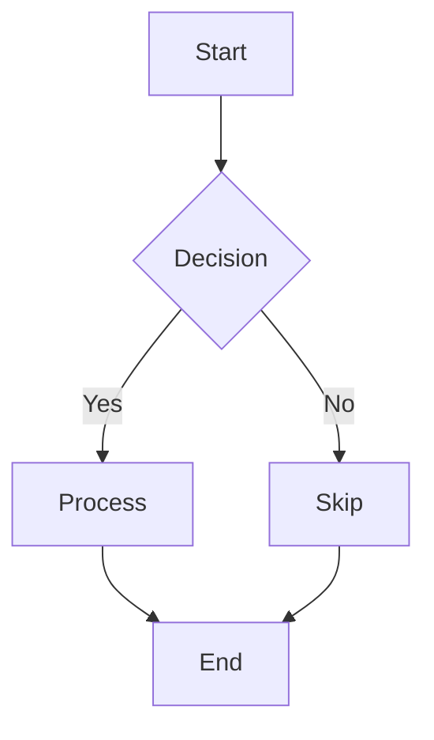

**Directions:** `TD` (top-down), `LR` (left-right), `BT` (bottom-top), `RL` (right-left)

**Node shapes:** `[rect]` `(rounded)` `{diamond}` `((circle))` `>flag]` `[/parallelogram/]` `[(cylinder)]` `[\\trapezoid/]`

**Link types:** `-->` `---` `-.->` `==>` `--text-->` `-->|label|`

---

## 2. Sequence Diagram

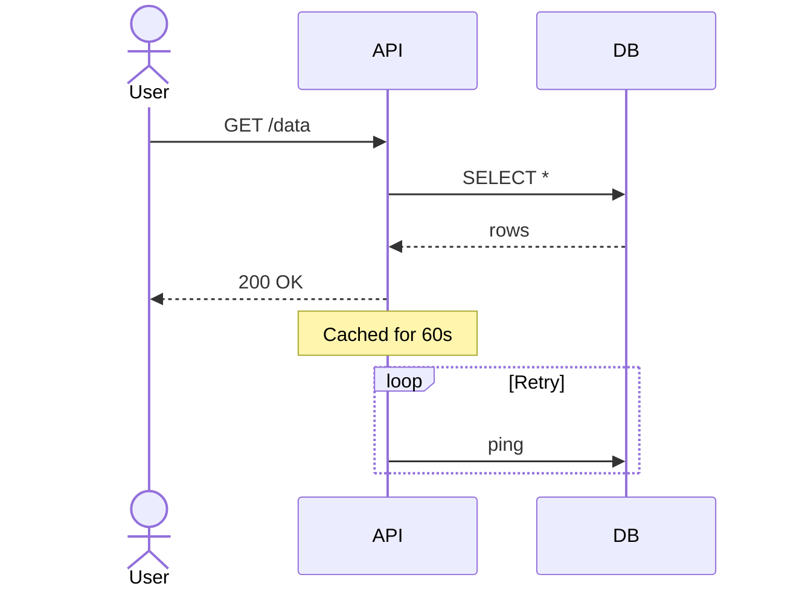

**Arrows:** `->>` (solid) `-->>` (dashed) `-x` (cross) `-)` (open/async)

**Blocks:** `loop`, `alt/else`, `opt`, `par`, `critical`, `break`, `rect`

---

## 3. Class Diagram

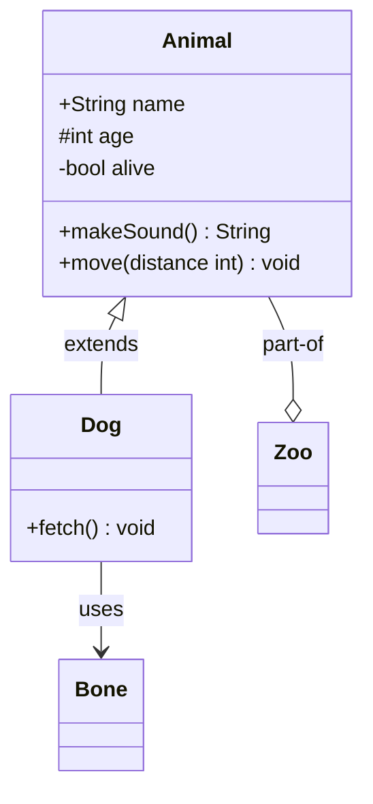

**Relationships:** `<|--` (inherit) `*--` (composition) `o--` (aggregation)
`-->` (association) `..>` (dependency) `<..` (realization) `--` (link)

**Visibility:** `+` public  `-` private  `#` protected  `~` package

---

## 4. State Diagram

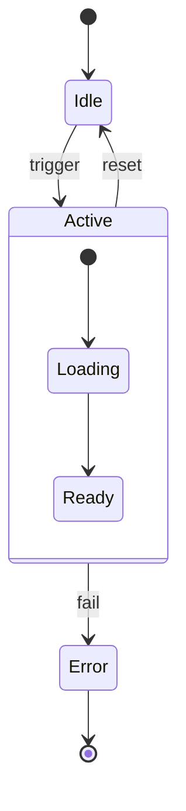

**Features:** Composite states, forks (`<<fork>>`), joins (`<<join>>`), history (`[H]`), notes

---

## 5. ER Diagram

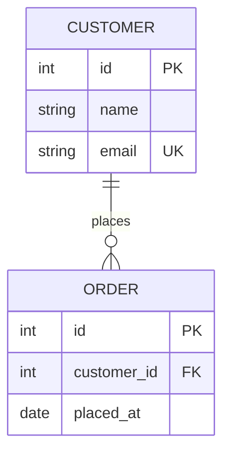

**Cardinalities:** `||` (exactly one) `|o` (zero or one) `}|` (one or more) `}o` (zero or more)

---

## 6. Gantt

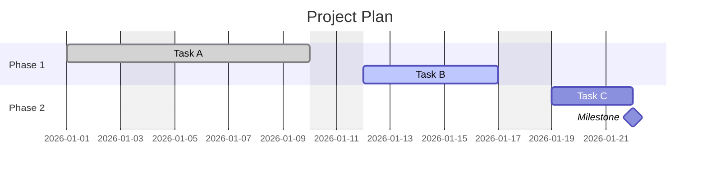

**Status:** `done` `active` `crit` `milestone`

---

## 7. Pie Chart

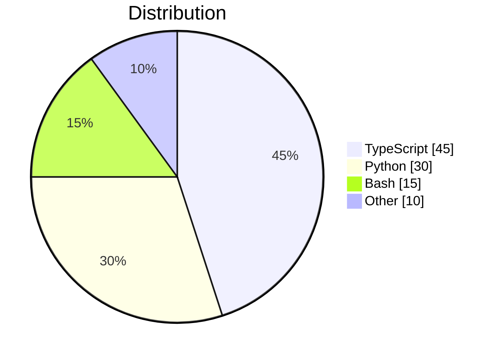

---

## 8. Git Graph

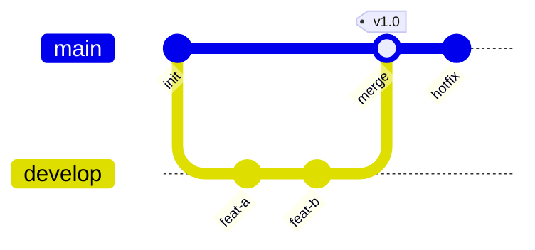

---

## 9. Mind Map

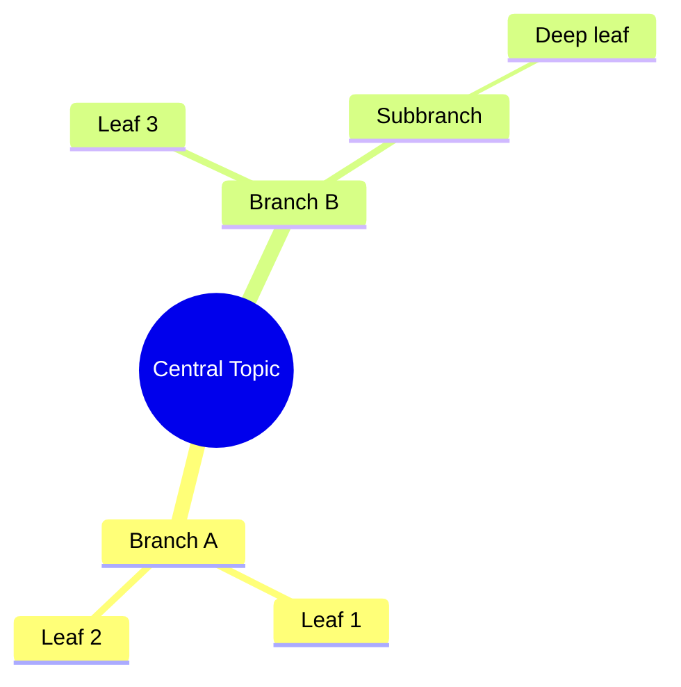

**Shapes:** `((circle))` `[square]` `(rounded)` `))cloud((` `{{hexagon}}`

---

## 10. Timeline

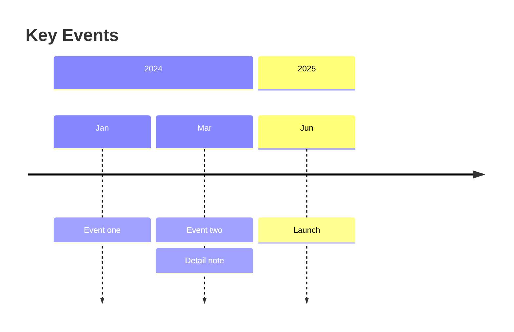

---

## 11. Kanban

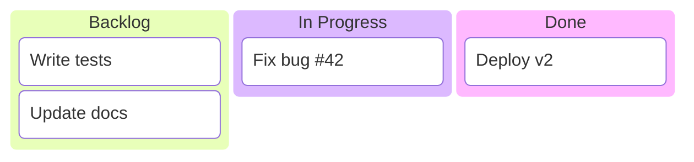

---

## 12. Quadrant Chart

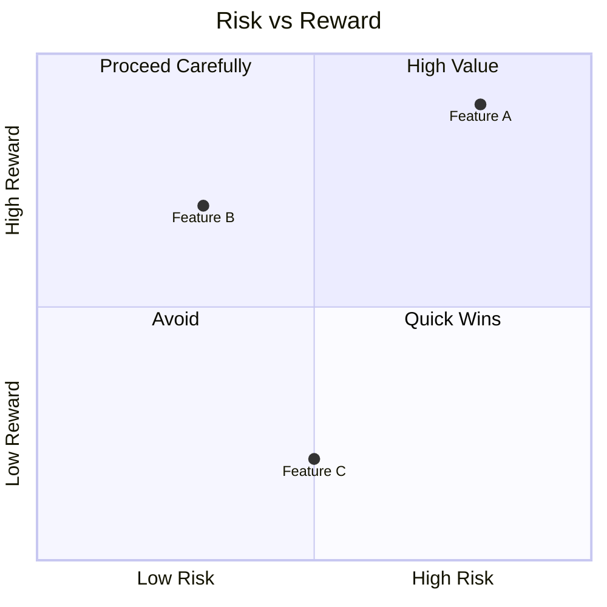

---

## 13. Requirement Diagram

```mermaid
requirementDiagram
    requirement UserAuth {
        id: REQ-001
        text: Must support OAuth2
        risk: high
        verifymethod: test
    }
    functionalRequirement DataExport {
        id: REQ-002
        text: Export to CSV and JSON
        risk: low
        verifymethod: inspection
    }
    element AuthModule {
        type: component
    }
    UserAuth - satisfies -> AuthModule
```

---

## 14. C4 Diagram

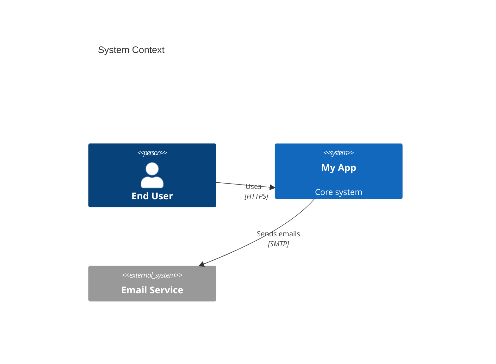

**Diagram levels:** `C4Context` `C4Container` `C4Component` `C4Dynamic` `C4Deployment`

---

## 15. Sankey

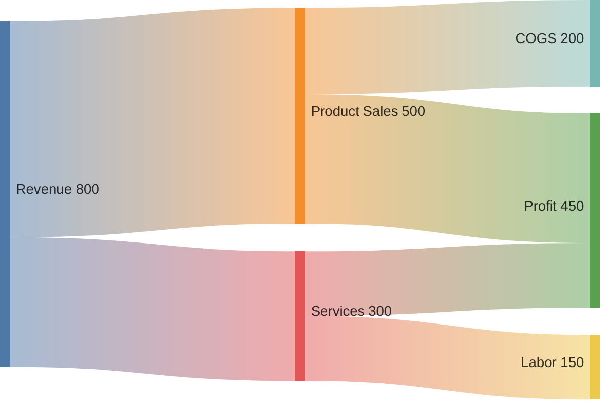

---

## 16. XY Chart (beta)

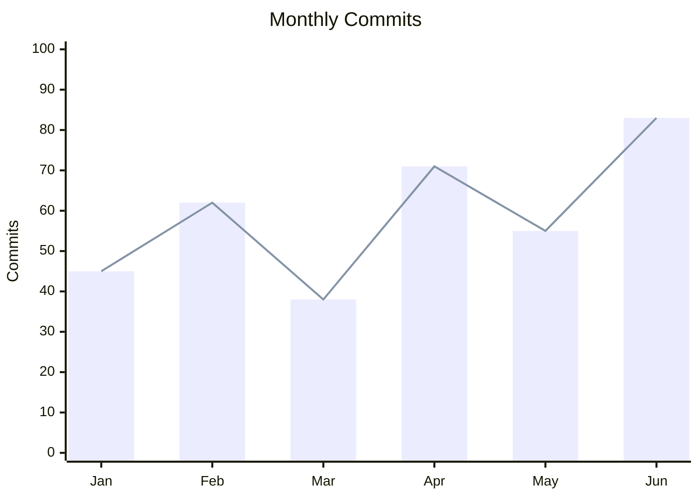

---

## 17. User Journey

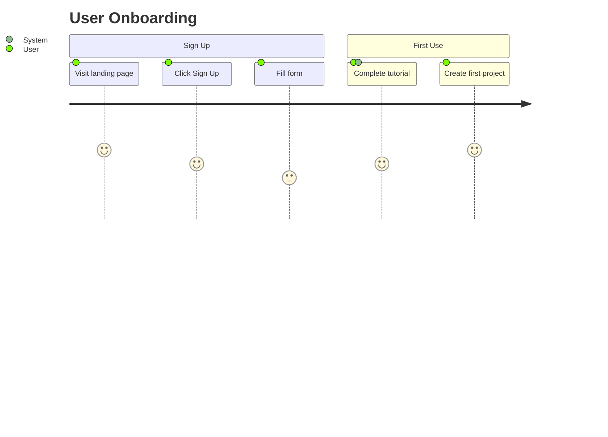

---

## 18. Architecture (beta)

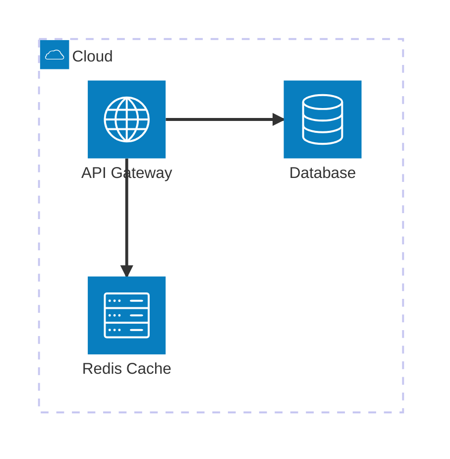

---

## 19. Block Diagram (beta)

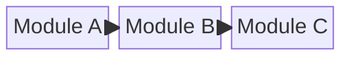

---

## 20. Packet (beta)

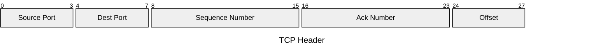

---

## 21. ZenUML

```mermaid
zenuml
    Client->Server: Request
    Server->DB: Query
    DB-->Server: Result
    Server-->Client: Response
```

---

## 22. Radar (Spider)

```mermaid
radar
    title Team Skills
    Developer : 85
    Designer : 60
    Devops : 70
    Security : 55
    Testing : 90
```

---

## 23. Treemap (experimental)

```mermaid
treemap
    root
        src 80
            components 45
            utils 20
            hooks 15
        tests 20
        docs 10
```

---

## 24. Venn (experimental)

```mermaid
venn
    sets [{"label": "Frontend"}, {"label": "Backend"}, {"label": "DevOps"}]
    intersections [[0,1,"Fullstack"], [1,2,"SRE"], [0,1,2,"Platform Eng"]]
```

---

## 25. Ishikawa / Fishbone

```mermaid
---
config:
  theme: neutral
---
%%{init: {"look": "handDrawn"}}%%
fishbone
    title Production Bug
    Method
        Manual deploy
    Machine
        Old server
    People
        No review
    Environment
        Config drift
```

---

## 26. Tree View (experimental)

```mermaid
treeView
    root[Project Root]
        src[src/]
            components[components/]
            utils[utils/]
        tests[tests/]
        docs[docs/]
```

---

## Mermaid Init Options

```
%%{init: {
  "theme": "default",
  "themeVariables": {
    "primaryColor": "#6366f1",
    "edgeLabelBackground": "#fff"
  }
}}%%
```

**Themes:** `default` `dark` `forest` `neutral` `base`
